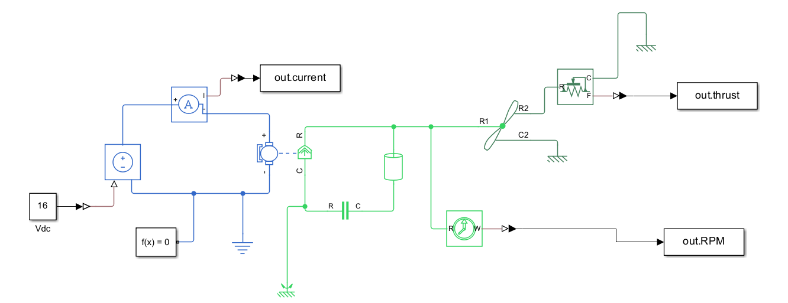
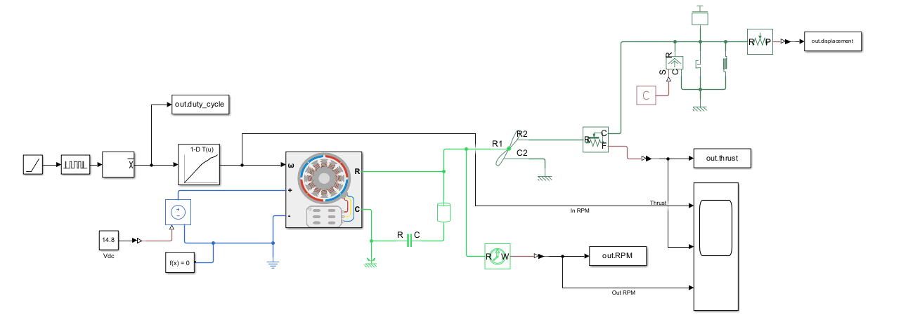

# MBSE & MathWorks systems handbook

## Contents

- Description
- Examples
- MATLAB
- Simulink
- Practical Applications

## Description
This repository is 

The code, images, and examples in this repository are based on data and systems for a lunar sample containment unit intended to align with NASA's RASC-AL competition. The system itself is designed to maintain the temperature and pressure needed to store lunar samples during transit between habitats or rovers on lunar missions. Some of the systems demonstrated in this repository include the temperature sensing and warning system, the battery power and control system, as well as the cooling system itself.
## Examples

<table>
<tr>

<td align="center">
  
   
  <b>MATLAB Graphing</b>
   
  <small>Visualization of experimental data using MATLAB plotting tools.</small>
</td>

<td align="center">
  
   
  <b>MATLAB Graphing</b>
   
  <small>Comparison of multiple datasets with customized graph formatting.</small>
</td>

<td align="center">
  
   
  <b>MATLAB Graphing</b>
   
  <small>Processed data displayed with labeled axes and legends.</small>
</td>

</tr>

<tr>

<td align="center">
  
   
  <b>MATLAB Graphing</b>
   
  <small>Final visualization highlighting key trends in the results.</small>
</td>

<td align="center">
  
   
  <b>Thermal Simulation</b>
   
  <small>Simulink model used to simulate the thermal behavior of the system.</small>
</td>

<td align="center">
  
   
  <b>Thermal Simulation</b>
   
  <small>Simulation results showing temperature response over time.</small>
</td>

</tr>
</table>

## MATLAB
blah blah blah
## Simulink
XYZ...
## Practical Applications

<td align="center">
  
   
  <b>Lab 6 control system</b>
   
  <small>Simulation results showing temperature response over time.</small>
</td>
<td align="center">
  
   
  <b>Lab 6 control system</b>
   
  <small>Simulation results showing temperature response over time.</small>
</td>

